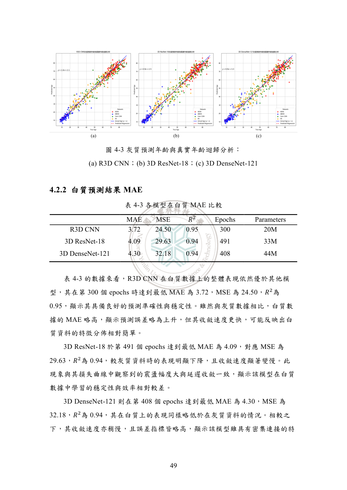
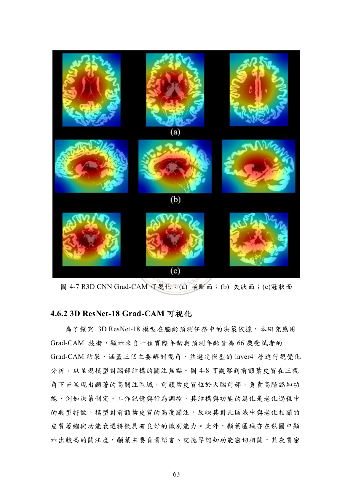
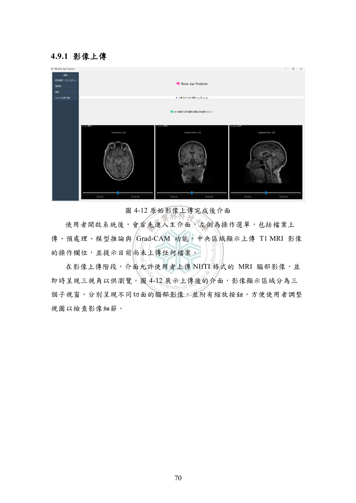
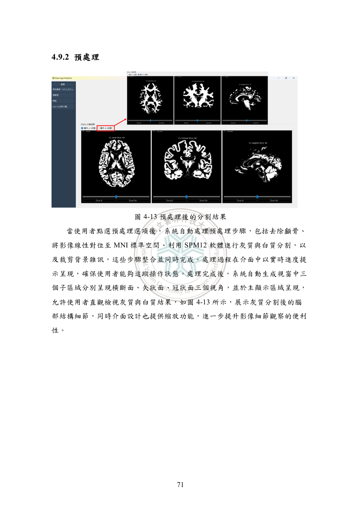
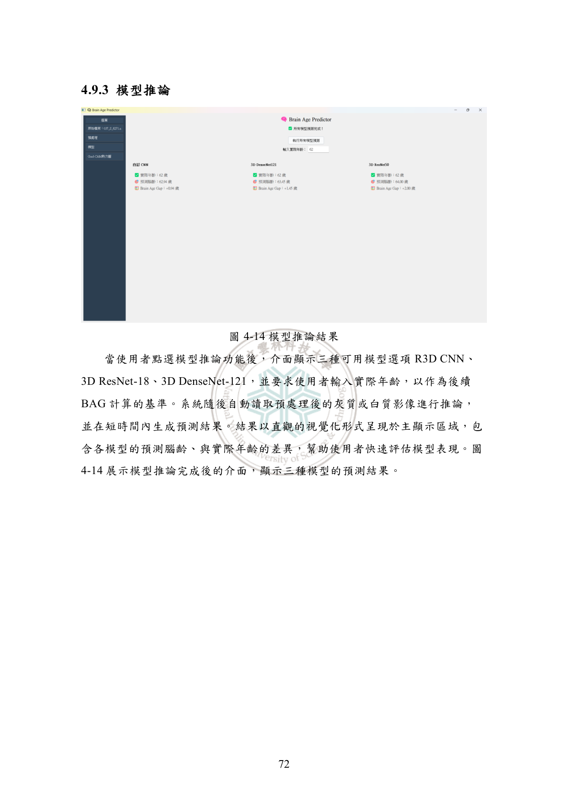
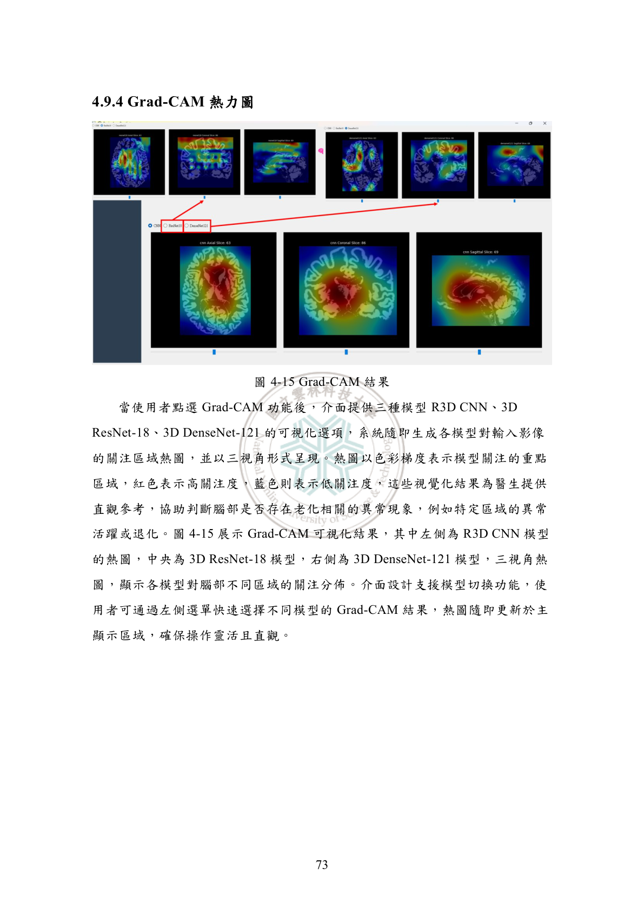

# 🧠 3D Brain Age Prediction with CNN

A deep learning framework for predicting brain age from 3D T1-weighted MRI scans using a custom **3D CNN with skip connections**. The project also implements multiple **multi-tissue fusion strategies** (gray matter + white matter) and includes a full **preprocessing pipeline** and **Grad-CAM visualization**.

---

## 📁 Project Structure

```
.
├── models/
│   └── cnn3d.py              # CNN3D model definition (single source of truth)
│
├── data/
│   └── dataset.py             # NIfTI dataset loader & volume preprocessing
│
├── preprocessing/
│   ├── preprocess.py           # Full pipeline: skull strip → register → segment
│   ├── crop.py                # Background cropping utility
│   └── run_spm_seg.m          # MATLAB SPM12 tissue segmentation script
│
├── combine/                   # Multi-tissue fusion methods
│   ├── mid_fusion.py          # Mid-level feature fusion with attention
│   ├── weighted_average.py    # Learnable weighted average of two models
│   ├── dual_channel.py        # 2-channel input (C1+C2 stacked)
│   ├── ml_ensemble.py         # XGBoost ensemble on CNN features
│   └── _dual_dataset.py       # Shared dual-channel dataset loader
│
├── train.py                   # Model training script
├── test.py                    # Evaluation: MAE, MSE, R²
├── gradcam.py                 # 3D Grad-CAM visualization
├── app.py                     # PyQt5 GUI application
│
├── assets/                    # Template files (MNI152)
├── samples/                   # Sample NIfTI files for testing
├── requirements.txt
├── .gitignore
└── README.md
```

---

## 🏗️ Model Architecture

**CNN3D** — A 3D convolutional neural network with **6 convolutional blocks**, each using residual skip connections, followed by global average pooling and fully connected layers for regression.

| Layer | Channels | Skip Connection |
|-------|----------|----------------|
| Conv Block 1 | 1 → 32 | — |
| Conv Block 2 | 32 → 64 | ✅ |
| Conv Block 3 | 64 → 128 | ✅ |
| Conv Block 4 | 128 → 256 | ✅ |
| Conv Block 5 | 256 → 512 | ✅ |
| Conv Block 6 | 512 → 1024 | ✅ |
| Global Avg Pool + FC | 1024 → 512 → 1 | — |

- **Activation**: LeakyReLU (0.01)
- **Regularization**: BatchNorm3D + Dropout (0.4)
- **Loss**: L1 (MAE)
- **Optimizer**: AdamW

---

## � Results

Trained on **2,555 subjects** (ages 6–90) from ADNI, IXI, Cam-CAN, and ABIDE datasets.

### Single-Modality Performance

| Model | Input | MAE ↓ | MSE | R² | Params |
|:--|:--|:--:|:--:|:--:|:--:|
| **CNN3D (Ours)** | Gray Matter | **3.56** | 22.79 | 0.96 | 20M |
| 3D ResNet-18 | Gray Matter | 4.00 | 28.50 | 0.95 | 33M |
| 3D DenseNet-121 | Gray Matter | 4.18 | 32.38 | 0.94 | 44M |
| **CNN3D (Ours)** | White Matter | **3.72** | 24.50 | 0.95 | 20M |

### Multi-Modal Fusion Performance

| Fusion Strategy | MAE ↓ | MSE | R² |
|:--|:--:|:--:|:--:|
| **🥇 Mid-level Fusion** | **3.37** | **20.20** | **0.96** |
| Weighted Average | 3.43 | 20.95 | 0.96 |
| R3D CNN-XGBoost | 3.49 | 21.82 | 0.96 |
| Input-level Fusion | 3.59 | 23.00 | 0.95 |

### Age-Stratified Performance (CNN3D, Gray Matter)

| Age Group | MAE | R² |
|:--|:--:|:--:|
| Young (≤ 30) | **1.84** | 0.87 |
| Middle (31–49) | 3.39 | 0.74 |
| Elderly (≥ 50) | 3.58 | 0.75 |

### Predicted vs. Actual Age — Regression Analysis



---

## 🔬 Grad-CAM Visualization

Grad-CAM heatmaps reveal that the model focuses on **aging-related brain regions**: prefrontal cortex, hippocampus, and corpus callosum — demonstrating biological plausibility.



---

## �🔬 Fusion Methods (combine/)

Four strategies for combining **gray matter (C1)** and **white matter (C2)** predictions:

| Method | Description |
|--------|-------------|
| **Mid-level Fusion** | Two CNN branches fuse at intermediate feature maps with SE + Spatial attention |
| **Weighted Average** | Two frozen CNNs with learnable weights: `w1·pred_c1 + w2·pred_c2` |
| **Dual Channel** | C1 + C2 stacked as 2-channel input to a single CNN |
| **ML Ensemble** | XGBoost regression on CNN-extracted features |

---

## 🖥️ GUI Application

An interactive PyQt5 application integrating MRI upload, preprocessing, multi-model inference, and Grad-CAM visualization.

| Upload & View | Preprocessing | Model Prediction | Grad-CAM |
|:---:|:---:|:---:|:---:|
|  |  |  |  |

---

## 🚀 Quick Start

### 1. Installation

```bash
pip install -r requirements.txt
```

> **Note**: Preprocessing requires [ANTsPy](https://github.com/ANTsX/ANTsPy) and [MATLAB](https://www.mathworks.com/) with [SPM12](https://www.fil.ion.ucl.ac.uk/spm/software/spm12/).

### 2. Data Preparation

Place your preprocessed NIfTI scans in a directory structure:

```
samples/
├── train/
│   ├── c1_subject001_25.nii.gz
│   ├── c1_subject002_30.nii.gz
│   └── ...
└── test/
    ├── c1_subject100_45.nii.gz
    └── ...
```

Filenames must end with `_<age>.nii` or `_<age>.nii.gz`.

### 3. Preprocessing (Optional)

If starting from raw T1 MRI scans:

```bash
python -m preprocessing.preprocess
```

This performs skull stripping → registration → SPM segmentation.

### 4. Training

```bash
python train.py --data_dir data_split --epochs 500 --lr 1e-3 --batch_size 2
```

### 5. Evaluation

```bash
python test.py --model_path best_cnn3d.pth --data_dir data_split/test
```

### 6. Grad-CAM Visualization

```bash
python gradcam.py --model_path best_cnn3d.pth --input scan.nii.gz
```

### 7. GUI Application

```bash
python app.py
```

---

## 📊 Datasets

The model was trained on data from the following public neuroimaging datasets:

- [ADNI](https://adni.loni.usc.edu/) — Alzheimer's Disease Neuroimaging Initiative
- [IXI](https://brain-development.org/ixi-dataset/) — Information eXtraction from Images
- [Cam-CAN](https://www.cam-can.org/) — Cambridge Centre for Ageing and Neuroscience
- [ABIDE](http://fcon_1000.projects.nitrc.org/indi/abide/) — Autism Brain Imaging Data Exchange

---

## 📝 Citation

If you use this code in your research, please cite our paper.

---

## 📄 License

This project is for academic use only.
